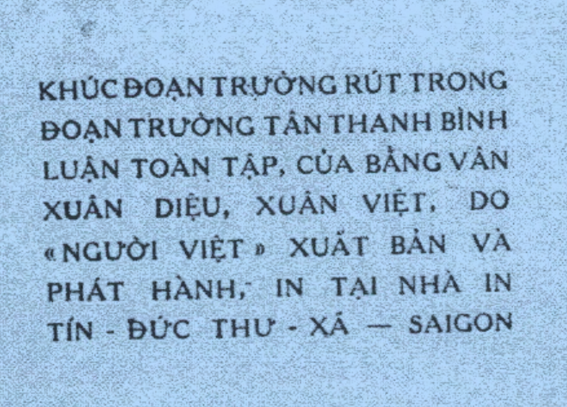

<!-- wp:heading -->

<h2>Phụ chú</h2>

<!-- /wp:heading -->

<!-- wp:heading {"level":4} -->

<h4>Lầu xanh : </h4>

<!-- /wp:heading -->

<!-- wp:paragraph -->

 bởi chữ <em>thanh lâu</em> trong Hán văn. Nguyên chữ <em>thanh lâu</em> từ trước vẫn là nói chỗ ở của các nhà quý hiển, các đế-vương. Về đời Đường , thi-sĩ hay dùng chữ <em>thanh lâu</em> để nói về bọn con gái ca xướng, nên từ đấy về sau, chữ <em>thanh lâu </em>riêng chỉ chỗ ở của bọn gái điếm. Đỗ Mục có câu: 

<!-- /wp:paragraph -->

<!-- wp:paragraph -->

<em>Tam niên nhất giác Dương châu mộng, Doanh đắc thanh lâu bạc hãnh danh</em> (Ba năm một tỉnh mộng Dương châu. Mang tiếng lầu xanh phụ bạc nhau)

<!-- /wp:paragraph -->

<!-- wp:paragraph -->

Chữ <em>thanh lâu</em> dịch ra <em>lầu xanh</em>, đem vào văn chương ta.

<!-- /wp:paragraph -->

<!-- wp:heading {"level":4} -->

<h4>Lá gió cành chim:</h4>

<!-- /wp:heading -->

<!-- wp:paragraph -->

Nàng Tiết-Đào là một danh kỹ đời Đường, khi còn nhỏ tục vận bài thơ vịnh cây ngô đồng của cha, có câu: <em>Chi nghênh nam bắc điểu, Dhiệp tống vãng lai phong, </em>Cha nghe khẩu khí ấy, biết con gái mình sau sẽ ra gì.

<!-- /wp:paragraph -->

<!-- wp:heading {"level":4} -->

<h4>Tống Ngọc, Tràng Khanh:</h4>

<!-- /wp:heading -->

<!-- wp:paragraph -->

Tống Ngọc là tên tự công-tủ Triều nước Sở (đời Chiến-Quốc), có tiếng đẹp trai. Tràng-Khanh là tên tự Tư-Mã Tương-Như đời Hán, văn hay đàn giỏi, có tiếng phong lưu.

<!-- /wp:paragraph -->

<!-- wp:heading {"level":4} -->

<h4>Sở, Tần:</h4>

<!-- /wp:heading -->

<!-- wp:paragraph -->

tên nước đời Chiến quốc bên tàu.

<!-- /wp:paragraph -->

<!-- wp:heading {"level":4} -->

<h4>Chín chữ cao sâu:</h4>

<!-- /wp:heading -->

<!-- wp:paragraph -->

Thơ Lục Nga trong Kinh Thi: <em>Phụ hề sinh ngã, mẫu hề cúc ngã, phú ngã súc ngã, trưởng ngã dục ngã, cố ngã phục ngã, xuất nhập phúc ngã, dục báo chí đức, hiệu thiên võng cực. (Cha sinh ra ta, mẹ cho ta bú, ẵm ta nuôi ta, nuôi nấng dạy dỗ, săn sóc chăm nom, ra vào nâng niu, muốn báo ơn ấy, như trời không cùng). </em>Đó gọi là chín chữ <em>cù lao (</em>cù lao nhọc nhằn).

<!-- /wp:paragraph -->

<!-- wp:heading {"level":4} -->

<h4>Bóng dâu tà tà:</h4>

<!-- /wp:heading -->

<!-- wp:paragraph -->

bởi chữ Hán <em>Nhật lạc tang du</em>, là mặt trời lặn vào nương dâu.

<!-- /wp:paragraph -->

<!-- wp:heading {"level":4} -->

<h4>Sân hoè :</h4>

<!-- /wp:heading -->

<!-- wp:paragraph -->

Nhà ông Vương Hựu đời Tống ở sân có ba cây hoè tươi tốt, người ta cho rằng ba cây hoà ấy ứng vào điềm các con ông sau làm đến Tam Công.

<!-- /wp:paragraph -->

<!-- wp:heading {"level":4} -->

<h4>Trân cam :</h4>

<!-- /wp:heading -->

<!-- wp:paragraph -->

Chữ Hán <em>trân </em>là quý, <em>cam</em> là ngọt, <em>Tran cam</em> là nói những thức ngon ngọt con phụng dưỡng cha mẹ.

<!-- /wp:paragraph -->

<!-- wp:heading {"level":4} -->

<h4>Ba sinh :</h4>

<!-- /wp:heading -->

<!-- wp:paragraph -->

Theo truyện thần tiên, trong động Càn-Khôn có hòn núi đá gọi là <em>Tam Sinh Thạch</em> (đá ba kiếp). Trai gái có duyên nợ với nhau, Nguyệt lão biên tên lên hòn đá ấy. Cổ thi: <em>Tam sinh thạch thượng cưu tinh hồn (Tinh hồn xưa gửi đá ba sinh)</em>

<!-- /wp:paragraph -->

<!-- wp:heading {"level":4} -->

<h4>Liễu Chương-đài :</h4>

<!-- /wp:heading -->

<!-- wp:paragraph -->

Chương-đài là tên một con đường ở Trường An, kinh đô đời nhà Hán. Tình sử: Hàn hủ yêu một nàng họ Liễu ở Trường an, khi xa cách, viết thư hỏi thăm có câu: <em>Chương đài liễu! Chương đài liễu!</em> <em>Tích nhật thanh thanh kim tại phủ ? Túng sử trường điều tựa cưu thuỳ. Dã ưng phan chiết tha nhân thủ!</em> (Liễu Chương-đài! Liễu Chương đài! Xưa xanh xanh vậy, nay thời ra sao? Cành dài dầu rủ thao thao. Có khi vin bẻ đã trao tay người)

<!-- /wp:paragraph -->

<!-- wp:heading {"level":4} -->

<h4>Hoàng hôn, hôn hoàng :</h4>

<!-- /wp:heading -->

<!-- wp:paragraph -->

Tống thi: <em>Khấp tổn song mâu tràng dục đoạn, Phụ hoàng hôn đáo hưu hôn hoàng. (Khóc đau con mắt đứt gan vàng, Sợ hết hoàng hôn lại hôn hoàng).</em> Hoàng là ánh sáng vàng, hôn là bóng tối. Hoàng hôn là lúc sáng tối chập chờn về buổi mai hay buổi tối. Chữ hoàng hôn, nghĩa như chữ crépuscule của Pháp. Thường thì hoàng hôn chỉ dùng để chỉ buổi chiều.

<!-- /wp:paragraph -->

<!-- wp:heading {"level":4} -->

<h4>Thỏ bạc ác vàng :</h4>

<!-- /wp:heading -->

<!-- wp:paragraph -->

Thỏ là mặt trăng. Truyên thần tiên nói trong mặt trăng có con thỏ ngọc. Ác là mặt trời. Sách Phật nói trong mặt trời cá con quạ (ác) vàng

<!-- /wp:paragraph -->

<!-- wp:heading {"level":4} -->

<h4>Đoạn tràng :</h4>

<!-- /wp:heading -->

<!-- wp:paragraph -->

nghĩa đen là đứt ruột, nghĩa bóng là sự bi thảm. Những chữ sổ đoạn trường, tập đoạn trường, hội đoạn trường, là do tác-giả đặt ra.

<!-- /wp:paragraph -->

<!-- wp:nextpage --> 
<!--nextpage--> 
<!-- /wp:nextpage -->

<!-- wp:image {"id":1186,"sizeSlug":"large"} -->

<!-- /wp:image -->

